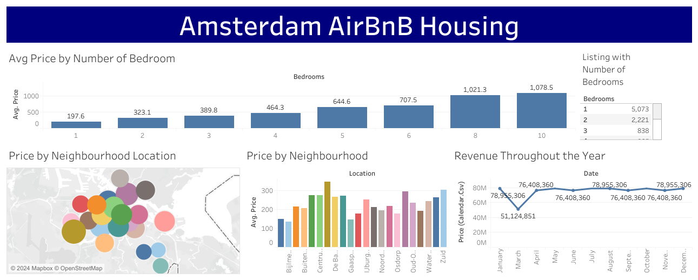

# Amsterdam Airbnb Housing Dashboard with Tableau

This repository contains a Tableau dashboard analyzing Airbnb housing data in Amsterdam. The dashboard provides insights into various aspects of Airbnb listings, including pricing, location, and availability.



## Table of Contents

- [Project Overview](#project-overview)
- [Features](#features)
- [Data Source](#data-source)
- [Getting Started](#getting-started)
- [Usage](#usage)
- [Contributing](#contributing)

## Project Overview

The Amsterdam Airbnb Housing Dashboard is designed to provide a comprehensive view of the Airbnb market in Amsterdam. It leverages Tableau's powerful visualization capabilities to present data in an intuitive and interactive manner.

## Features

- **Interactive Maps**: Visualize Airbnb listings across Amsterdam with geographical context.
- **Pricing Analysis**: Breakdown of prices for 3 nights, by location and neighbourhood.
- **Revenue Details**: Revenue of Airbnb throughout the year of 2024 in Amsterdam.

## Data Source

The data used in this dashboard is sourced from Airbnb's public dataset on [Inside Airbnb](http://insideairbnb.com/get-the-data.html). This dataset includes information about Airbnb listings in Amsterdam, such as prices, availability, and host details.

## Getting Started

To view the Tableau dashboard, follow these steps:

1. Clone this repository:
    ```sh
    git clone https://github.com/tanvirtanmoy/Amsterdam-Airbnb-Dashboard.git
    ```
2. Open the Tableau workbook file `Amsterdam Airbnb Housing Dashboard.twbx` in Tableau Desktop.

## Usage

- Use the interactive filters to explore data for different neighborhoods and listing types.
- Hover over map points to see detailed information about specific listings.


## Contributing

Contributions are welcome! Please open an issue to discuss what you would like to change or add.


